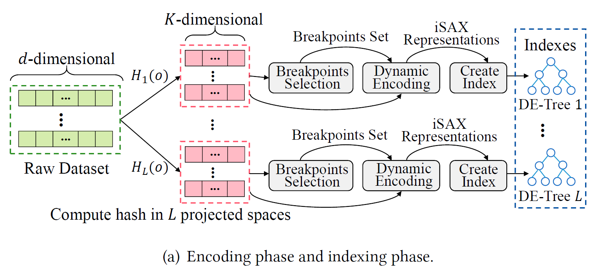

# DET-LSH
[DET-LSH ](https://github.com/WeiJiuQi/DET-LSH) paper implementation!

TO-DO'S

- Compute hash in $L$ projected spaces ✅
- Implement Breakpoints Selection 🛠️
- Implement Dynamic encoding 🛠️
- Implement Create Index 🛠️

